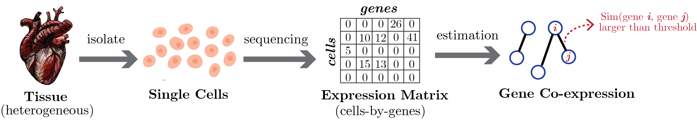

# scRNAseq_Coexpression_Benchmark
A benchmark of existing gene co-expression estimator on scRNA-seq data.

**Contents will be completed soon!**

-----

## Problem Definition

We formulate the gene co-expression estimation on scRNA-seq data as an unsupervised undirected graph structure learning task. The scRNA-seq data can be formalized into an expression matrix $\mathbf{X} \in \mathbb{Z}_{*}^{n \times p}$ of $n$ cells and $p$ genes. Here, $\mathbb{Z}_{*}$ denotes the non-negative integers set. Each element $\mathbf{X}_{ij}$ is a count value denoting the expression level of gene $j$ at cell $i$. Given the expression matrix, we say a pair of genes are co-expressed if the genes have similar expression patterns. So the goal of gene co-expression estimation is to estimate a symmetric gene similarity matrix ${\bf W} \in \mathbb{R}^{p \times p}$ with ${\bf W}_{jk}$ indicating the similarity score between genes $j$ and $k$. We can convert the similarity matrix to an adjacency matrix $\mathbf{G} \in \{0, 1\}^{p \times p}$, encoding a co-expression network with nodes denoting genes and undirected edges connecting two nodes $i$ and $j$ if the corresponding pair of genes are significantly co-expressed.  

-----

## Data Preparation

### Experimental Data
We use eight publicly available scRNA-seq datasets in this study. We extract data of four different sequencing protocols from [mouse cortex](https://singlecell.broadinstitute.org/single_cell/study/SCP425/single-cell-comparison-cortex-data\#study-summary) dataset and [human peripheral blood mononuclear cells (PBMC)](https://singlecell.broadinstitute.org/single_cell/study/SCP424/single-cell-comparison-pbmc-data\#study-summary) dataset downloaded from [Single Cell Protal](https://singlecell.broadinstitute.org/single_cell). Codes for pre-processing experimental dataset ae provided in (TODO: code)

### Simulated Data

We have codes for previus two simulation processes:

- ZI-Gaussian:
- ZI-Poisson: 

The codes for two novel simulation processed introduced in our study are:

- NORTA:
- SERGIO: 

-----

## Method

We have tested nine gene co-expression network estimation methods in this study. They consist of five methods designed for microarray or bulk RNA-seq data and four methods for scRNA-seq data. These methods cover a wide range of state-of-the-art and commonly used gene co-expression estimators with different data distribution assumptions and co-expression measurements. (TODO: citation of codes) These methods are summarized in the Table below.  
| **Name**              | **Co-expression Measurement** | **Network Estimation** | **Hyper-parameter**      | **Assumption**                  |
|:---------------------:|:-----------------------------:|:----------------------:|:------------------------:|:-------------------------------:|
| **Pearson**           |  Pearson correlation           | thresholding           | threshold $\delta$       | NA                              |
| **Spearman**          |  Spearman correlation          | thresholding           | threshold $\delta$       | NA                              |
| **MINet**             |  mutual information            | thresholding           | threshold $\delta$       | NA                              |
| **GLasso(Cov)**       |  sample covariance             | MLE                    | regularization $\lambda$ | Gaussian                        |
| **GENIE3**            |  regression trees              | thresholding           | threshold $\delta$       | NA                              |
| **PIDC**              |  partial information           | thresholding           | threshold $\delta$       | gamma or Gaussian               |
| **scLink**            |  robust correlation            | MLE                    | regularization $\lambda$ | gamma-Gaussian mixture          |
| **GLasso(scDesign2)** |  copula correlation            | MLE                    | regularization $\lambda$ | zero-inflated negative binomial |
| **ZILNBGM**           |  regression coefficient        | regression             | regularization $\lambda$ | zero-inflated negative binomial |

-----

## Evaluation

We consider the gene co-expression estimation as a binary classification task.  In the true co-expression network, ${\bf G}^*_{ij} \neq 0$ represents genes $i$ and $j$ are co-expressed. So all non-zeros in $\mathbf{G}$ are considered positives, and zeros are negatives. $\widehat{{\bf G}} \in \{0, 1\}^{p \times p}$ denotes the estimated co-expression. We evaluate methods with these metrics:

- F1-score: F1-score of estimation is computed with the upper triangle (without diagonal entries) of ground truth ${\bf G}^*$ and prediction $\widehat{{\bf G}}$, because the co-expression matrix is a symmetric matrix with diagonal entries all 1s. $\text{F1-score}=\frac{2}{\text{precision}^{-1} + \text{recall}^{-1}}$ with $\text{precision}=\frac{\text{\# true positives}}{\text{\# estimated positives}},~\text{recall}=\frac{\text{\# true positives}}{\text{\# actual positives}}$.

- Ratio of false positives: we compute false discovery rate (FDR) and positive predictive value (PPV), or precision with $\text{FDR}=\frac{\text{\# false positives}}{\text{\# estimated positives}}$ and $\text{PPV}=1-\text{FDR}$. 

- AUROC and AUPRC: we also include the area under the receiver operating characteristic curve (**AUROC**) and the area under the precision-recall curve (**AUPRC**) values. For each of the 100 trials, we compute the estimation's precision, recall, true positive rates, and false positive rates. AUPRC and AUROC are calculated based on curves constructed from these 100 metric values.

-----

## Benchmarks

### Compare Propertis of Simulations

### Evaluate Existing Methods on New Simulations

### Simulations with Different Settings

### Simulations with Dfferent Pre-processing Approaches

-----

## Visualization

All codes for visualization are provided in (TODO: citation)

